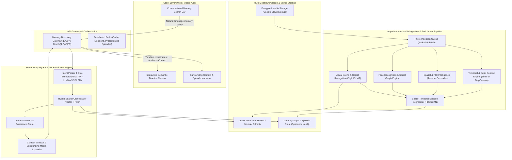
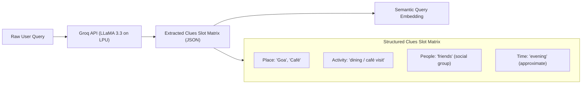
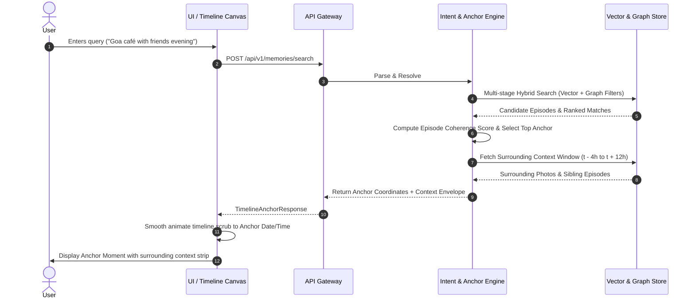
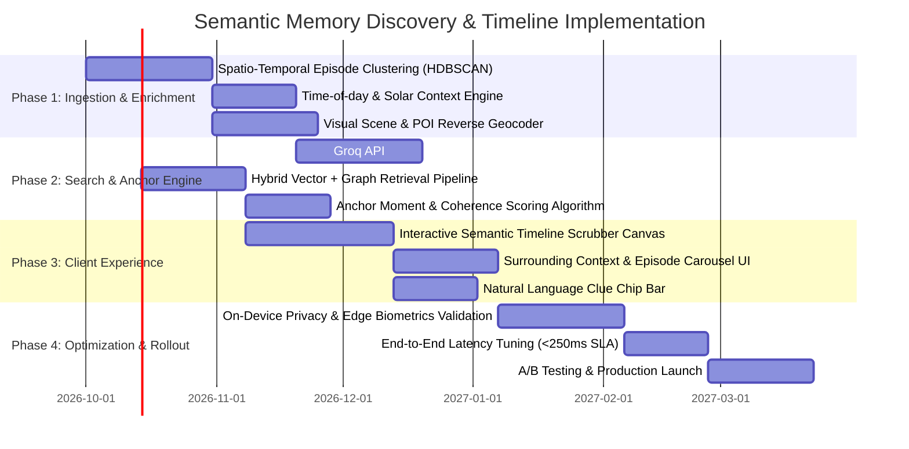

# Architecture Plan: Google Photos Semantic Memory Discovery & Timeline Engine

## 1. Executive Summary & System Vision

Traditional media discovery tools treat photo libraries as databases of discrete files retrieved through keyword matching (e.g., `"dog"`, `"beach"`, `"sunset"`). However, human episodic memory functions through **multidimensional narrative context**—combining **Place**, **Activity**, **People**, and **Time** (*"those photos from Goa when we went to a café with friends in the evening"*).

This architecture transitions Google Photos from **isolated file retrieval** to a **Semantic Memory Timeline**. Rather than returning a disconnected grid of matching image thumbnails, the system identifies the exact **Anchor Moment** within the user's chronological photo narrative and projects a **Context Window** (surrounding photos, events, and trips), enabling users to fluidly relive and navigate their experiences.

```
+-----------------------------------------------------------------------------------+
|                                PARADIGM SHIFT                                     |
|                                                                                   |
|  Traditional Search:  "Which photos match 'café'?"   --> [Photo] [Photo] [Photo]  |
|                                                                                   |
|  Semantic Timeline:   "Where in my photo history is  --> [ Timeline Scrub Bar ]   |
|                        the Goa café evening?"              |                      |
|                                                     +------v--------------------+ |
|                                                     | Anchor: Nov 18, 7:30 PM   | |
|                                                     | Context: Trip to Goa      | |
|                                                     | Surrounding: 35 photos    | |
|                                                     +---------------------------+ |
+-----------------------------------------------------------------------------------+
```

---

## 2. High-Level System Architecture

The system comprises five decoupled tiers communicating over high-speed gRPC and asynchronous event streams:



---

## 3. Core Subsystems Breakdown

### 3.1 Media Ingestion & Multi-Modal Enrichment Pipeline

Every photo ingested undergoes feature extraction to create rich contextual metadata:

1. **Visual Semantics & Scene Recognition**:
   - Generates high-dimensional multi-modal embeddings using an efficient vision-language encoder (e.g., SigLIP / ViT-H/14).
   - Extracts semantic labels: scene types (café, beach, indoors, rooftop), activities (dining, partying, hiking), ambiance (cozy, dim lighting, festive), and detected objects.
2. **Social Graph & People Clustering**:
   - Identifies face landmarks and associates them with clustered personal contacts.
   - Computes relationship clusters and social groupings (e.g., frequent co-occurrences labeled as *"friends"*, *"family"*, *"college group"*).
3. **Spatial & POI Intelligence**:
   - Reverse-geocodes EXIF GPS coordinates into hierarchical geographic entities: `Country > State > City > Neighborhood > Point of Interest (POI)`.
   - Enriches raw coordinates with venue categorizations (e.g., Latitude/Longitude mapped to *"Café Lilliput, Anjuna, Goa"*).
4. **Temporal & Solar Context Engine**:
   - Calculates local solar elevation to assign experiential time buckets: `Dawn`, `Morning`, `Afternoon`, `Golden Hour`, `Sunset`, `Evening`, `Night`.
   - Identifies calendar heuristics: weekends, holidays, multi-day trip patterns (sudden displacement from home location).
5. **Spatio-Temporal Episode Segmenter**:
   - Groups individual photos into cohesive **Episodes** (micro-events lasting 30 minutes to 4 hours) and **Trips/Journeys** (macro-events spanning days) using density-based clustering (HDBSCAN) over time and geo-distance.

---

### 3.2 The Semantic Memory Knowledge Graph & Vector Store

Rather than indexing photos in isolation, the storage schema indexes both individual assets and their parent **Episodes**:

```
+-------------------------------------------------------------------------+
|                               EPISODE                                   |
| ID: ep_982341                                                           |
| Title: "Evening at Anjuna Beach Café, Goa"                              |
| Time Range: 2023-11-18 18:30:00 to 2023-11-18 21:45:00                  |
| Time Bucket: "Evening" / "Dinner"                                       |
| Location: "Goa, India" -> "Anjuna" -> "Café Lilliput" (Type: Cafe/Bar)  |
| Participants: [User, Friend_A, Friend_B, Friend_C] (Group: "Friends")   |
| Activity Tags: ["dining", "coffee", "cocktails", "socializing"]         |
| Aggregated Embedding: [0.034, -0.128, 0.441, ...] (Episode Centroid)   |
| Anchor Keyframe Photo ID: photo_55102                                   |
| Photo IDs (Ordered): [photo_55090 ... photo_55145] (56 photos)          |
+-------------------------------------------------------------------------+
```

- **Vector Database**: Stores embeddings of photo keyframes and episode centroids with HNSW indexes for sub-10ms nearest neighbor queries.
- **Relational/Graph Store**: Maintains social relationships, location hierarchies, and chronological episode links (`previous_episode`, `next_episode`, `parent_trip`).

---

### 3.3 Conversational Query Intent Engine (Powered by Groq API)

When a user enters a query like:
> *"I’m looking for those photos from Goa when we went to a café with friends in the evening."*

The Intent Engine leverages the **Groq API** with its specialized Language Processing Unit (LPU) architecture to deliver ultra-fast, deterministic slot extraction and semantic understanding:



#### Groq API Integration Specification
The engine utilizes `llama-3.3-70b-versatile` (or `llama-3.1-8b-instant` for ultra-low latency) with Groq's native JSON mode:

```typescript
import Groq from "groq-sdk";

const groq = new Groq({ apiKey: process.env.GROQ_API_KEY });

export async function parseMemoryIntent(userQuery: string): Promise<ParsedMemorySlots> {
  const response = await groq.chat.completions.create({
    model: "llama-3.3-70b-versatile",
    response_format: { type: "json_object" },
    temperature: 0.1,
    messages: [
      {
        role: "system",
        content: `You are an expert episodic memory parser for personal photo archives. 
Extract contextual memory clues from the user prompt into structured JSON.
Schema:
{
  "place": { "region": string | null, "poiCategory": string | null, "specificVenue": string | null },
  "activity": string | null,
  "peopleGroup": "friends" | "family" | "colleagues" | "solo" | null,
  "temporal": { 
    "timeOfDay": "dawn" | "morning" | "afternoon" | "golden_hour" | "evening" | "night" | null,
    "relativeSeason": string | null,
    "yearHint": number | null 
  }
}`
      },
      {
        role: "user",
        content: userQuery
      }
    ]
  });

  return JSON.parse(response.choices[0].message.content) as ParsedMemorySlots;
}
```

#### Clue Disambiguation & Fallbacks
- **Place Slot**: Disambiguates geographic scale (`"Goa"` = Region/State) and venue type (`"café"` = POI category).
- **Time Slot**: Resolves ambiguous descriptors (`"evening"`, `"last monsoon"`, `"college days"`, `"before COVID"`).
- **People Slot**: Matches generic terms (`"friends"`, `"mom"`, `"office colleagues"`) to graph clusters based on co-occurrence and explicit labels.
- **Activity Slot**: Converts colloquial descriptions into visual concept embeddings.
- **LPU Latency Advantage**: While typical cloud LLM inference takes 400–1200ms, Groq LPUs complete slot extraction in **~30–50ms**, preserving almost the entire latency budget for timeline projection and asset rendering.

---

### 3.4 Memory Anchor & Timeline Projection Engine

This engine fulfills the core paradigm shift: determining **where in photo history** the memory lives and generating the contextual envelope.



#### Anchor Scoring Formula
Each candidate episode $E$ is scored using a hybrid coherence function:

$$Score(E) = w_1 \cdot \text{Sim}_{\text{vector}}(\mathbf{q}_{\text{emb}}, \mathbf{e}_{\text{emb}}) + w_2 \cdot \text{Match}_{\text{geo}} + w_3 \cdot \text{Match}_{\text{people}} + w_4 \cdot \text{Match}_{\text{time}} + w_5 \cdot \text{Coherence}(E)$$

Where:
- $\text{Sim}_{\text{vector}}$: Cosine similarity between query embedding and episode visual centroid.
- $\text{Match}_{\text{geo}}$: Spatial match against place taxonomy (State: Goa, POI: Café).
- $\text{Match}_{\text{people}}$: Proportion of social circle present in the cluster.
- $\text{Match}_{\text{time}}$: Solar time match (photos taken between 17:30 and 22:00 local time).
- $\text{Coherence}(E)$: Cluster density, photo count, and quality factor.

#### Context Window Projection
Once the Anchor Episode is identified:
1. **Micro-Context Window**: Returns all photos from the episode ($t_0$ to $t_1$), highlighting 3–5 representative "hero" keyframes.
2. **Meso-Context Window**: Pre-fetches the surrounding 12–24 hours (e.g., photos from earlier that afternoon at the beach, and the return journey the next morning).
3. **Macro-Context Window (Trip Container)**: Links the anchor to the broader trip container (`"Trip to Goa, Nov 16–20, 2023"`), allowing one-tap zooming outward.

---

### 3.5 Interactive Client Experience & UI Architecture

The client application integrates three responsive UI surfaces:

1. **Context-Aware Memory Search Bar**:
   - Displays real-time parsed token chips as the user types: `[📍 Goa]` `[☕ Café]` `[👥 Friends]` `[🌙 Evening]`.
   - Allows users to tap chips to adjust confidence or add missing clues.
2. **Semantic Timeline Canvas**:
   - A smooth, zoomable timeline (Year $\rightarrow$ Month $\rightarrow$ Trip $\rightarrow$ Day $\rightarrow$ Episode $\rightarrow$ Photo).
   - Upon query execution, the timeline smoothly scrubs and zooms directly to the **Anchor Moment**.
   - Displays a visual marker on the timeline highlighting the episode boundary and confidence rating.
3. **Contextual Narrative Carousel**:
   - Positioned beneath the anchor photo, displaying a horizontal "Surrounding Moments" strip with breadcrumbs:
     `Library > 2023 > Goa Trip > Saturday, Nov 18 > Evening Café`.
   - Provides instant "Jump to earlier that day" and "Jump to next morning" action chips.

---

## 4. Data Schemas & API Specifications

### 4.1 Memory Episode Schema (TypeScript Definition)

```typescript
export interface MemoryEpisode {
  id: string;                         // Unique episode ID (e.g. "ep_20231118_goa_01")
  title: string;                      // Synthesized title: "Evening at Café Lilliput"
  summary: string;                    // Short narrative summary
  tripId?: string;                    // Parent trip container ID
  startTime: string;                  // ISO 8601 UTC timestamp
  endTime: string;                    // ISO 8601 UTC timestamp
  timeOfDayBucket: 'dawn' | 'morning' | 'afternoon' | 'golden_hour' | 'evening' | 'night';
  
  location: {
    country: string;
    state: string;
    city: string;
    neighborhood?: string;
    poiName?: string;
    poiCategory?: string;             // e.g. "cafe", "beach", "restaurant"
    coordinates: { latitude: number; longitude: number };
  };
  
  participants: {
    personId: string;
    displayName: string;
    relationshipGroup: 'friends' | 'family' | 'colleagues' | 'other';
  }[];
  
  activityTags: string[];             // e.g. ["dining", "coffee", "beachfront"]
  
  anchorPhotoId: string;              // Primary representative photo
  photoCount: number;
  photoIds: string[];                 // Ordered sequence of photo IDs
  
  centroidEmbedding: number[];        // 768-dim multi-modal vector
}
```

### 4.2 Query Intent & Response Payload

```json
// POST /api/v1/memories/search - Request Payload
{
  "query": "I'm looking for those photos from Goa when we went to a café with friends in the evening",
  "clientTimestamp": "2026-09-29T21:00:00Z",
  "targetLibraryId": "user_lib_9981"
}

// POST /api/v1/memories/search - Response Payload
{
  "parsedIntent": {
    "place": { "name": "Goa", "category": "cafe" },
    "activity": "dining / cafe visit",
    "peopleGroup": "friends",
    "temporal": { "timeOfDay": "evening" }
  },
  "primaryAnchor": {
    "episodeId": "ep_20231118_goa_01",
    "confidenceScore": 0.94,
    "timestamp": "2023-11-18T19:30:00Z",
    "anchorPhoto": {
      "photoId": "photo_55102",
      "url": "https://photos.google.com/media/photo_55102.jpg",
      "caption": "Friends seated at beachside cafe in Anjuna"
    },
    "timelinePosition": {
      "year": 2023,
      "month": 11,
      "day": 18,
      "normalizedPosition": 0.7842
    }
  },
  "contextWindow": {
    "parentTrip": {
      "tripId": "trip_goa_nov2023",
      "title": "Trip to Goa",
      "startDate": "2023-11-16",
      "endDate": "2023-11-20",
      "totalPhotos": 420
    },
    "episodePhotos": [
      { "photoId": "photo_55098", "timestamp": "2023-11-18T19:15:00Z" },
      { "photoId": "photo_55102", "timestamp": "2023-11-18T19:30:00Z", "isAnchor": true },
      { "photoId": "photo_55115", "timestamp": "2023-11-18T20:10:00Z" }
    ],
    "surroundingEpisodes": [
      {
        "episodeId": "ep_20231118_beach_01",
        "title": "Anjuna Beach Walk earlier that afternoon",
        "timeRange": "15:30 - 17:45"
      },
      {
        "episodeId": "ep_20231119_brunch_01",
        "title": "Brunch in Panaji next morning",
        "timeRange": "10:00 - 12:30"
      }
    ]
  },
  "alternativeAnchors": [
    {
      "episodeId": "ep_20220214_goa_cafe",
      "confidenceScore": 0.68,
      "title": "Café Bodega, Goa (Feb 2022)"
    }
  ]
}
```

---

## 5. Privacy, Security & Edge-Cloud Hybrid Architecture

Photo libraries contain users' most sensitive personal moments. The architecture enforces strict privacy-by-design standards:

| Layer | Processing Location | Implementation Details |
| :--- | :--- | :--- |
| **Face Clustering & Biometrics** | **On-Device (Edge)** | Face embeddings and personal identity mappings are computed locally on mobile devices and stored in encrypted on-device SQLite databases. Raw biometric templates are never transmitted in clear text. |
| **Visual Feature Extraction** | **Hybrid (Edge/Private Cloud)** | Lightweight models run on device for instant local search; higher-fidelity SigLIP models run inside private, sandboxed, user-partitioned cloud tenants. |
| **Search Queries & Groq Inference** | **Groq Cloud API (Zero Retention)** | Natural language prompts are processed via Groq Cloud API with zero-retention (ZDR) policy. Queries are parsed ephemerally on LPUs without persistent logging or model training. |
| **Access Control** | **Zero-Trust IAM** | Every vector index and knowledge graph node is partitioned by user cryptographic ID. Cross-tenant leakage is physically barred at the vector index boundary. |

---

## 6. Performance, Latency & Scalability Targets

To ensure the experience feels immediate and fluid:

- **End-to-End Query Latency**: $\le 200\text{ ms}$ (p95) from query submission to timeline navigation.
- **Intent Parsing Latency (Groq API)**: $\le 35\text{ ms}$ using Groq LPU inference (`llama-3.3-70b-versatile` / `llama-3.1-8b-instant` generating at 300–750 tokens/sec).
- **Hybrid Vector + Graph Retrieval**: $\le 45\text{ ms}$ over 100,000+ photos per user library using clustered HNSW indexes.
- **Client Timeline Animation**: 60–120 FPS hardware-accelerated smooth scrolling on mobile and web viewports.
- **Cache Hit Ratio**: $\ge 85\%$ for precomputed macro-episodes and trip boundaries.

---

## 7. Implementation Roadmap & Phases



---

## 8. Summary of Architectural Impact

By transforming photo search into an **Anchor & Timeline Projection Engine**, this architecture directly fulfills the mandate in `docs/context.md`:
1. **Natural Memory Clues**: Deconstructs conversational input into multi-dimensional filters.
2. **Context Fusion**: Joins Place, Activity, People, and Time through the **Episode** abstraction.
3. **Temporal Anchoring**: Locates **where** in history the memory occurred rather than returning unmoored images.
4. **Surrounding Context**: Automatically expands the view to let users explore what happened before, during, and after that moment.
