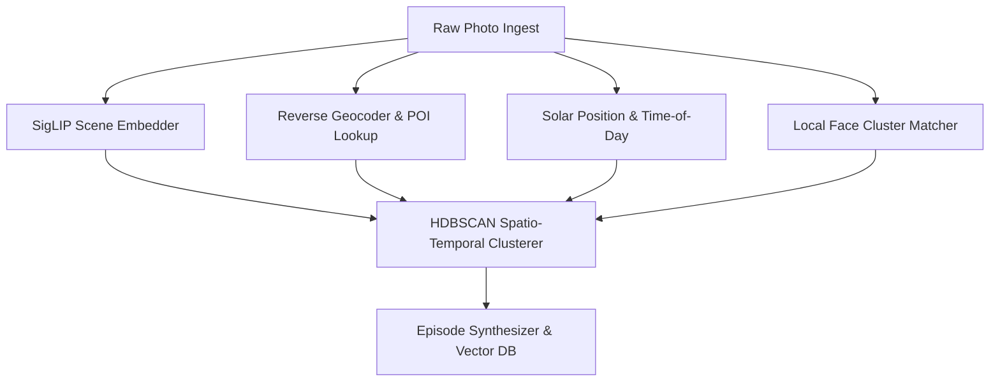
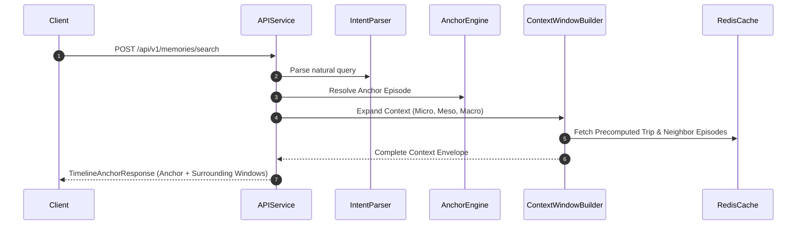

# Implementation Plan: Google Photos Semantic Memory Discovery & Timeline Engine

## 1. Plan Overview & Engineering Philosophy

This document outlines the step-by-step engineering plan to build the **Google Photos Semantic Memory Discovery & Timeline Engine**, translating the product vision in [context.md](file:///c:/Users/kumar/Desktop/New%20folder%20%285%29/docs/context.md) and technical architecture in [architecture.md](file:///c:/Users/kumar/Desktop/New%20folder%20%285%29/docs/architecture.md) into concrete, milestone-driven phases.

### Core Strategic Tenets
1. **Incremental Validation**: Build and validate backend intelligence (enrichment, clustering, anchor scoring) with synthetic datasets before binding complex UI animations.
2. **Context-First Delivery**: Shift every layer from returning unmoored image lists to generating cohesive **Episodes** embedded within a continuous **Context Window**.
3. **Strict Latency & Privacy Budgets**: Enforce sub-250ms p95 query latency and zero-trust, privacy-first edge processing from day one.

---

## 2. Phase-by-Phase Roadmap


---

## Phase 0: Foundations, Schemas & Test Fixtures

**Objective**: Establish repository infrastructure, core schemas, database configurations, and realistic benchmark datasets.

### Key Deliverables
- [x] **Repository & Workspace Setup**:
  - Monorepo or modular architecture separating `core-engine`, `enrichment-pipeline`, `api-service`, and `client-web`.
  - Type-safe contracts via TypeScript / Protocol Buffers (gRPC).
- [x] **Data Schemas Definition**:
  - Implement the `MemoryEpisode`, `MediaAssetContext`, `ContextualQueryIntent`, and `TimelineAnchorResponse` models in code.
  - Setup migrations for relational/graph storage (PostgreSQL/Spanner) and vector indices (Qdrant/Milvus/pgvector).
- [x] **Synthetic Evaluation Dataset ("Goa Trip" Fixture)**:
  - Generate a 500-photo synthetic library containing:
    - Exif GPS coordinates (Anjuna, Panaji, Baga in Goa; Home location in Bangalore/Mumbai).
    - Accurate chronological timestamps spanning a 4-day trip.
    - Simulated face clusters (Friend A, Friend B, Friend C).
    - Pre-computed 768-dim mock visual embeddings for café scenes, beach sunsets, and dinners.

### Acceptance Criteria
- Unit tests validating serialization/deserialization of schemas.
- Synthetic dataset successfully seeded and queried via baseline SQL/vector tests.

---

## Phase 1: Ingestion, Multi-Modal Enrichment & Spatio-Temporal Episode Clustering

**Objective**: Ingest photos, enrich them with semantic and environmental metadata, and group raw photos into cohesive **Episodes** and **Trips**.



### Detailed Tasks
1. **Visual Embedding Pipeline**:
   - Integrate vision-language model (SigLIP / ViT-B/16 or ViT-H/14) to compute normalized 768-dim embeddings per photo.
   - Extract semantic tags: scene types (`cafe`, `beach`, `urban`), activities (`dining`, `walking`, `celebrating`), and ambiance.
2. **Geospatial & POI Intelligence**:
   - Build hierarchical geocoder: GPS $\rightarrow$ Country $\rightarrow$ State (`Goa`) $\rightarrow$ City (`Anjuna`) $\rightarrow$ POI Category (`Cafe/Restaurant`).
   - Associate venue radius boundaries with nearby photos.
3. **Temporal & Solar Context Engine**:
   - Implement astronomical solar position calculator based on GPS latitude/longitude and UTC timestamp.
   - Output discrete experiential buckets: `dawn`, `morning`, `afternoon`, `golden_hour`, `evening`, `night`.
4. **Spatio-Temporal Episode Segmentation (HDBSCAN)**:
   - Combine spatial distance (Haversine metric) and temporal delta into a unified distance matrix.
   - Cluster photos into micro-events (30 min to 4 hours) $\rightarrow$ **Episodes**.
   - Group contiguous episodes outside the user's home radius into macro-events $\rightarrow$ **Trips**.
5. **Episode Keyframe & Centroid Synthesis**:
   - Compute episode visual centroid vector by averaging constituent photo embeddings.
   - Automatically designate the primary **Anchor Keyframe Photo** based on visual quality, facial expressions, and scene representativeness.

### Acceptance Criteria
- Running the clustering pipeline on the 500-photo Goa test dataset accurately produces:
  - 1 Macro Trip: `"Trip to Goa"` (Nov 16–20).
  - Individual Episodes: `"Anjuna Beach Afternoon"`, `"Evening at Beach Café"`, `"Panaji Brunch"`.
- Episode centroid embeddings stored in vector index with sub-10ms retrieval latency.

---

## Phase 2: Conversational Clue Parsing & Hybrid Retrieval Engine (Groq API Integration)

**Objective**: Parse natural language memory descriptions into multi-dimensional slot filters using the high-throughput **Groq API** and implement the hybrid scoring algorithm that selects the primary **Anchor Moment**.

### Detailed Tasks
1. **Conversational Intent Parser via Groq API**:
   - Integrate Groq API SDK (`groq-sdk` for Node.js / TypeScript or `groq` for Python).
   - Configure Groq client with `GROQ_API_KEY` and select `llama-3.3-70b-versatile` (with `llama-3.1-8b-instant` as low-latency fallback).
   - Implement structured output parsing via Groq's native JSON mode (`response_format: { type: "json_object" }`) with strict Zod schema validation:
     ```
     Input: "photos from Goa when we went to a café with friends in the evening"
     Groq LPU Output: {
       "place": { "region": "Goa", "poiCategory": "café", "specificVenue": null },
       "activity": "dining / café visit",
       "peopleGroup": "friends",
       "temporal": { "timeOfDay": "evening", "relativeSeason": null, "yearHint": null }
     }
     ```
   - Benchmark Groq API token speed to ensure slot extraction finishes within **30–50ms**.
   - Implement fuzzy time resolver for colloquial phrases (`"evening"`, `"last monsoon"`, `"college days"`).
2. **Hybrid Search Orchestrator**:
   - **Step A (Vector Search)**: Query vector index using the prompt's visual semantic embedding to find top $K=50$ candidate photos/episodes.
   - **Step B (Graph & Metadata Filtering)**: Filter/boost candidates matching extracted slots (`state == 'Goa'`, `poiCategory == 'cafe'`, `timeOfDay == 'evening'`).
3. **Anchor Moment Coherence Scoring**:
   - Implement the scoring formula:
     $$Score(E) = w_1 \cdot \text{Sim}_{\text{vector}} + w_2 \cdot \text{Match}_{\text{geo}} + w_3 \cdot \text{Match}_{\text{people}} + w_4 \cdot \text{Match}_{\text{time}} + w_5 \cdot \text{Coherence}(E)$$
   - Rank candidate episodes and select the top Episode as the **Primary Anchor Moment**.
   - Select fallback / alternative anchors when confidence is divided across multiple trips.

### Acceptance Criteria
- Querying *"those photos from Goa when we went to a café with friends in the evening"* returns the `"Evening at Beach Café"` episode as the #1 ranked anchor with confidence score $> 0.90$.
- Groq API slot extraction executes in $< 50\text{ ms}$.
- Overall hybrid retrieval latency under 100ms.

---

## Phase 3: Context Window Projection & Backend API Layer

**Objective**: Dynamically generate the surrounding chronological context envelope and expose high-speed, secure API endpoints for client consumers.



### Detailed Tasks
1. **Context Window Builder**:
   - **Micro-Window**: Retrieve all photos in the anchor episode in chronological sequence, identifying the hero photo.
   - **Meso-Window**: Expand to sibling episodes within $\pm 12$ hours (e.g., earlier that afternoon, later that night).
   - **Macro-Window**: Retrieve parent trip summary, date range, and boundary coordinates.
2. **Caching Strategy**:
   - Implement Redis caching for user trip structures and episode boundaries (TTL: 7 days, invalidated upon new photo uploads).
3. **API Implementation**:
   - `POST /api/v1/memories/search`: Main entry point returning parsed intent, anchor coordinates, and context envelope.
   - `GET /api/v1/timeline/window`: Infinite scroll and zoom endpoint to fetch adjacent historical segments on demand.
4. **Security & Zero-Trust User Partitioning**:
   - Ensure all queries are scoped strictly by authenticated `user_id`.
   - Ensure biometric/face IDs never cross user library boundaries.

### Acceptance Criteria
- Full API integration test passes end-to-end: query $\rightarrow$ intent parse $\rightarrow$ anchor resolution $\rightarrow$ context projection returned in $< 200\text{ ms}$.

---

## Phase 4: Client Experience — Semantic Timeline, Search Bar & Narrative UI

**Objective**: Deliver a premium, responsive web/mobile interface featuring the Conversational Clue Bar, Zoomable Semantic Timeline, and Contextual Narrative Strip.

### Detailed Tasks
1. **Conversational Memory Search Bar with Dynamic Clue Chips**:
   - Rich input box supporting natural language input.
   - Real-time token highlighting and interactive chip generation:
     - `[📍 Place: Goa, Café]`
     - `[👥 People: Friends]`
     - `[🌙 Time: Evening]`
     - `[🍽️ Activity: Dining]`
   - Users can tap any chip to edit, remove, or pin specific constraints.
2. **Interactive Semantic Timeline Canvas**:
   - Timeline minimap showing years, months, and detected trip markers.
   - **Smooth Anchor Animation**: Upon receiving search results, the timeline automatically scrubs and zooms from the current view directly to the Anchor Moment date (`Nov 18, 2023`).
   - Clear visual spotlight highlighting the resolved Episode on the timeline rail.
3. **Hero Anchor & Surrounding Photos Carousel**:
   - Display the primary anchor photo in high resolution with contextual metadata badge.
   - Horizontal "Surrounding Moments" strip showing:
     - **Before**: *"Afternoon at Anjuna Beach"* (2:00 PM – 5:30 PM).
     - **Current Anchor**: *"Dinner at Beach Café"* (7:30 PM – 10:00 PM).
     - **After**: *"Brunch in Panaji Next Morning"* (10:30 AM).
   - Breadcrumb navigation: `Library > 2023 > Trip to Goa > Saturday Evening`.

### Acceptance Criteria
- Responsive, 60fps smooth scrolling animation when jumping to anchor moments.
- Interactive clue chips reflect the parsed query accurately and update results upon removal/edit.

---

## Phase 5: Evaluation, Privacy Hardening & Production Rollout

**Objective**: Optimize system performance, audit edge privacy constraints, evaluate usability metrics, and conduct phased rollout.

### Detailed Tasks
1. **Performance Tuning & Latency Optimization**:
   - Profile query-to-render pipeline to guarantee sub-250ms p95 latency.
   - Enable client-side asset prefetching for surrounding context photos.
2. **Privacy Audit**:
   - Verify on-device face matching isolation.
   - Audit ephemeral processing of search queries (no persistent query logging without consent).
3. **Quality & Usability Evaluation**:
   - **Benchmark Test Suite**: 100 natural language memory scenarios (testing varying combinations of Place, Activity, People, Time).
   - **Key Metrics Tracked**:
     - *Anchor Accuracy@1*: Percentage of queries where the top returned episode is the desired moment ($Target \ge 85\%$).
     - *Time-to-Relive*: Seconds taken for a user to locate a memory compared to traditional keyword search ($Target: 65\% \text{ reduction}$).
4. **Phased Rollout**:
   - Canary deployment to internal dogfooders $\rightarrow 5\%$ user cohort $\rightarrow$ General Availability.

---

## 3. Work Breakdown & Effort Estimation

| Phase | Milestone Name | Key Deliverables | Estimated Duration | Target Completion |
| :--- | :--- | :--- | :--- | :--- |
| **Phase 0** | Foundations & Data Models | Schemas, DB setup, synthetic dataset | 2 Weeks | End of Week 2 |
| **Phase 1** | Enrichment & Clustering | SigLIP embedding, Geocoder, Solar time, HDBSCAN | 4 Weeks | End of Week 6 |
| **Phase 2** | Groq API Intent & Anchor Engine | Groq SDK, LLaMA 3.3 slot extractor, hybrid scoring | 3 Weeks | End of Week 9 |
| **Phase 3** | Context Window & APIs | Context expander, Redis cache, gRPC/REST APIs | 2 Weeks | End of Week 11 |
| **Phase 4** | Client UI & Timeline | Clue chips, zoomable timeline canvas, context strip | 4 Weeks | End of Week 15 |
| **Phase 5** | Privacy, Latency & Launch | Privacy audit, latency tuning (<250ms), A/B launch | 3 Weeks | End of Week 18 |
| **Total** | **End-to-End Implementation** | **Production-ready Semantic Memory Timeline** | **18 Weeks** | **~4.5 Months** |

---

## 4. Risk Matrix & Mitigation Strategies

| Risk Description | Severity | Likelihood | Mitigation Strategy |
| :--- | :--- | :--- | :--- |
| **Ambiguous or Vague Queries** (e.g. *"that time we had fun"*)| High | Medium | Groq API prompt detects low entropy and returns the top 3 candidate trips with clarifying prompt chips (*"Which trip did you mean: Goa 2023 or Manali 2022?"*). |
| **Groq API Quotas / Network Fluctuations** | Medium | Low | Use in-memory Redis cache for frequent queries; fallback to `llama-3.1-8b-instant` if rate limits approach; automatic retry with exponential backoff. |
| **GPS Missing / Disabled Photos** | High | High | Infer location transitively from chronologically adjacent photos in the same camera roll burst; use visual landmark detection as fallback. |
| **Slow Vector Search on Massive Libraries** | Medium | Medium | Partition vector indexes hierarchically by Year and Trip; prune candidate search space using temporal filters before ANN vector scan. |
| **User Privacy Concerns regarding Face Clustering** | Critical | Low | Restrict face clustering strictly to on-device hardware (Apple Neural Engine / Android NPU); never send raw biometric face vectors to centralized servers. |
| **Timeline Navigation Disorientation** | Medium | Low | Use animated inertia transitions ("fly-to" camera easing) accompanied by a prominent breadcrumb banner so the user never loses their temporal bearings. |

---

## 5. Next Steps

1. **Review and approve** this implementation plan.
2. Initialize **Phase 0** by setting up the project scaffolding and generating the synthetic evaluation fixture dataset.
